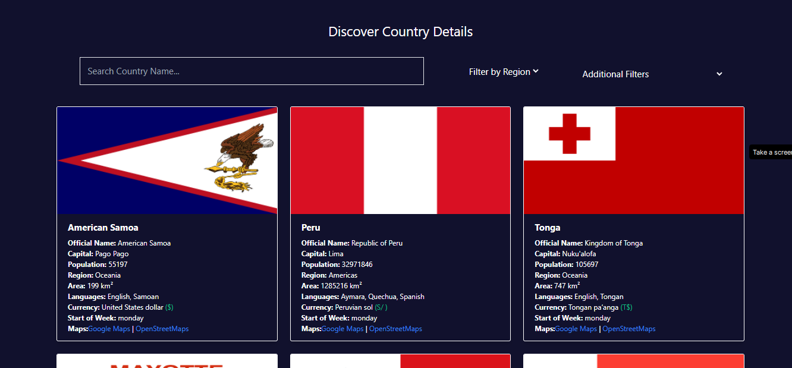

# CountryInfo Web App

CountryInfo Web is an engaging and user-friendly web application that empowers users to delve into comprehensive information about various countries around the world. Whether you are a curious traveler, a geography enthusiast, or someone seeking knowledge about different nations, this app has got you covered! Discover fascinating details about each country, including its official name, capital city, currency, currency symbol, population, region, area, language, and even the start of the week for that country. Additionally, you can explore the location of the country on Google Maps or OpenStreetMap with just a single click!

## Features

### Intuitive Search

The app boasts an intuitive search functionality that allows you to effortlessly find information about any country. Simply enter the name of the country in the search box, and the app will instantly display its complete profile.

### Flexible Filters

Customize your country exploration with powerful filtering options. You can sort countries alphabetically from A to Z or vice versa. Moreover, you can filter countries by regions or languages, helping you navigate the world based on your preferences. For example, you can explore all countries in Asia or filter countries that have English as their official language.

### Interactive Maps

To make your geographical exploration even more enjoyable, CountryInfo Web integrates interactive maps. Upon finding the desired country, click the map link to open Google Maps or OpenStreetMap, allowing you to explore the country's location visually.

### Responsive Design

CountryInfo Web is designed with responsiveness in mind. It adapts seamlessly to various screen sizes and devices, ensuring a smooth user experience whether you're using a desktop, laptop, tablet, or smartphone.

## Folder Structure

The project follows the conventional folder structure of a React Vite app. Inside the `src` directory, you'll find the following components:

1. **Grid Box Component**: This component creates an attractive grid layout to showcase country boxes with relevant information.
2. **Heading Component**: The Heading component includes an input box for searching countries and provides options to apply various filters.
3. **Data Component**: The Data component fetches data from the RestCountry API, organizes it into boxes, and then displays the information using the Grid Box component.

## Technologies Used

CountryInfo Web is built using the following cutting-edge technologies:

- **React Vite App**: A lightning-fast development environment for building React applications.
- **Tailwind CSS**: A versatile utility-first CSS framework that ensures responsive and stylish user interfaces.
- **RestCountry API**: This API acts as a valuable data source, providing essential country-related information that powers the app.

## Installation and Usage

If you want to run CountryInfo Web on your local system, follow these simple steps:

1. Clone the repository: `git clone https://github.com/Rishabh6306/Countries-Info-ReactWebApp`
2. Navigate to the app directory: `cd app_name`
3. Install dependencies: `npm install`
4. Start the development server: `npm run dev`

## Screenshots

Here are a few screenshots of CountryInfo Web App:

## Feedback and Contributions

We welcome your valuable feedback and contributions to make CountryInfo Web even better. If you encounter any issues, have ideas for enhancements, or want to collaborate, please open a pull request or reach out to me on LinkedIn at [Rishabh Srivastava](https://www.linkedin.com/in/rishabh-srivastava-b68684262/). Your participation is highly appreciated!

Embark on a journey to explore the world with CountryInfo Web App!